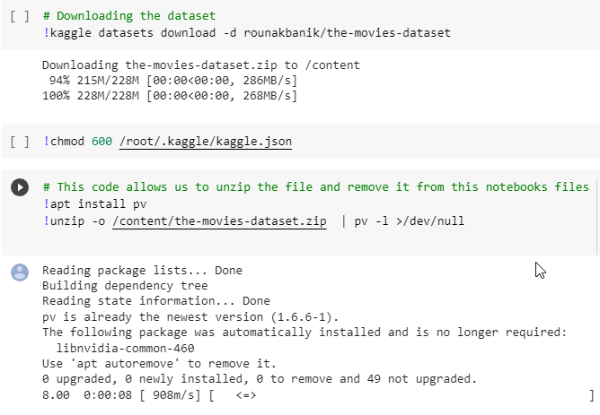

[](https://classroom.github.com/online_ide?assignment_repo_id=8127897&assignment_repo_type=AssignmentRepo)
<!--
Name of your teams' final project
-->
# Using Neural Networks to Develop a Movie Recommendation System

## [National Action Council for Minorities in Engineering(NACME)](https://www.nacme.org) Google Applied Machine Learning Intensive (AMLI) at the `MORGAN STATE UNIVERSITY`

<!--
List all of the members who developed the project and
link to each members respective GitHub profile
-->

**Developers:**
- [Antoine Teague](http://https://github.com/ATeague02 "Antoine Teague") - Morgan State University 
- [Jermaine Lennon](http://https://github.com/JermaineLennon "Jermaine Lennon") - Morgan State University 
- [Samuel Adeleye](http://https://github.com/toade16 "Samuel Adeleye") - Morgan State University 
- [Nasir Barnes](http://https://github.com/nasir-barnes1 "Nasir Barnes") - Morgan State University 

## Description
This project is practically a movie search engine for movies released before July 2017. We used Neural networks to develop a model that creates a list of 10 recommended movies based off of a users prompted input.  It askes the user which movie feature they want to search by, in which they would have to specify the feature(s) they are searching with right after. Then, the model will identify 10 movies in a modified dataframe and listing them from the most similar results to the least. 
## Model/Neural Network
Basic Neural Network breakdown.([Digital Trends-What is an artificial neural network?](http://https://www.digitaltrends.com/cool-tech/what-is-an-artificial-neural-network/ "Digital Trends-What is an artificial neural network?"))
[](http://https://www.digitaltrends.com/wp-content/uploads/2017/11/artificial_neural_network_1.jpg?fit=791%2C388&p=1)


Neuro Network Designed for movie recommndation.([MDPI-Enhancing Knowledge of Propagation-Perception.](http://https://www.mdpi.com/2079-9292/11/4/547/htm "MDPI-Enhancing Knowledge of Propagation-Perception."))
[](https://www.mdpi.com/electronics/electronics-11-00547/article_deploy/html/images/electronics-11-00547-g003-550.jpg)

## Instructions
- Uploadthe Capstone.ipynb file into colab
- Upload the ```kaggle.json``` file into your colabs session storage
- Download the datasets in your code block using the fololowing:


### Project Roles
- **Samuel Adeleye:** Project Leader and Auditor. Assigned project goals during the duration of the model development. In charge of creating the Data Folder including all of the datasets used in the project and Design Document that contains a brief overview of the project including the process of developing the model, project goals and the problems we ran into. 
- **Jermaine Lennon:** Lead Code Designer, in charge of the google colab file. The main contributer to developing and training the model. Looked over the Data Analysis part of the colab making sure there is no missing data and seeing if the model has accurate outputs.
- **Nasir Barnes:** Note Taker, taking note of every setback we have during our development process, the progress we made and any changes we decided to make as a group. Took care of our Ethical Considerations and Decision Log which includes documentation of our recognition of any potential bias within our model and every decision that has been made.
- **Antoine Teague:** Presentation Designer, in control of making sure every document looks polished and well represented in Github. In charge of creating the PowerPoint presentation and README file that should include the overview of the project and a step by step breakdown on how we completed it. 

## Contacts
Antoine Teague: antea1@morgan.edu,
Sameul Adeleye: toade16@morgan.edu,
Nasir Barnes: nabar15@morgan.edu,
Jermaine Lennon: jelen2@morgan.edu

## Usage instructions
<!--
Give details on how to install fork and install your project. You can get all of the python dependencies for your project by typing `pip3 freeze requirements.txt` on the system that runs your project. Add the generated `requirements.txt` to this repo.
-->
1. Fork this repo
2. Change directories into your project
3. On the command line, type `pip3 install requirements.txt`
4. ....
